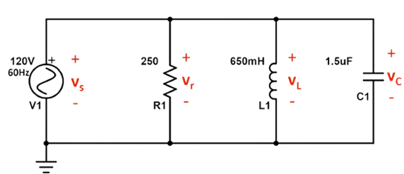
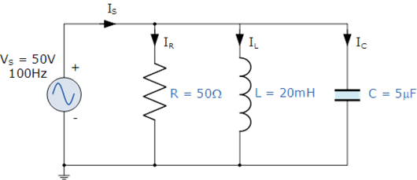
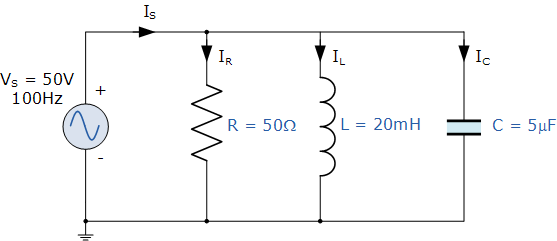

## Post Test 
#### Please attempt the following questions

 

 
Q1. For the following circuit. Calculate magnitude of impedance?

A. 187.97

B. 192.18

C. 76.22

D. 201.87
 
Q2. For the following circuit. Calculate the phase angle of impedance?

A. 41.3

B. 32.5

C. 60.3

D. 55.1
 
Q3. For the following circuit. Calculate the magnitude of phase current?

A. 0.228 A

B. 0.345 A

C. 0.639 A

D. 0.541 A
 
Q4. For a parallel RLC circuit with a 16Ω resistor, 8Ω inductor, 20Ω capacitor, and a 120V power supply. Find the Current through the capacitor?

A. 7 A

B. 7.5 A

C. 15 A

D. 6 A
 
Q5. For a parallel RLC circuit with a 16Ω resistor, 8Ω inductor, 20Ω capacitor, and a 120V power supply. Find the source current?

A. 11.71 A

B. 23.22 A

C. 10.91 A

D. 9.89 A
 
Q6. While drawing vector diagram for a series circuit, the reference vector is?

A. Voltage

B. Current

C. Power

D. Phase angle
 
Q7. For the following parallel RLC circuit. Find conductance?

A. 0.001

B. 0.002

C. 0.003

D. 0.004
 
Q8. For the following parallel RLC circuit. Calculate admittance?

A. 0.089

B. 0.0455

C. 0.078

D. 0.092
 
Q9. For the following parallel RLC circuit. Calculate source current?

A. 3.87

B. 4.12

C. 1.27

D. 2.92
 
Q10. For the following parallel RLC circuit. Calculate power factor?

A. 0.965 lead

B. 0.965 lag

C. 0.259 lead

D. 0.259 lag

