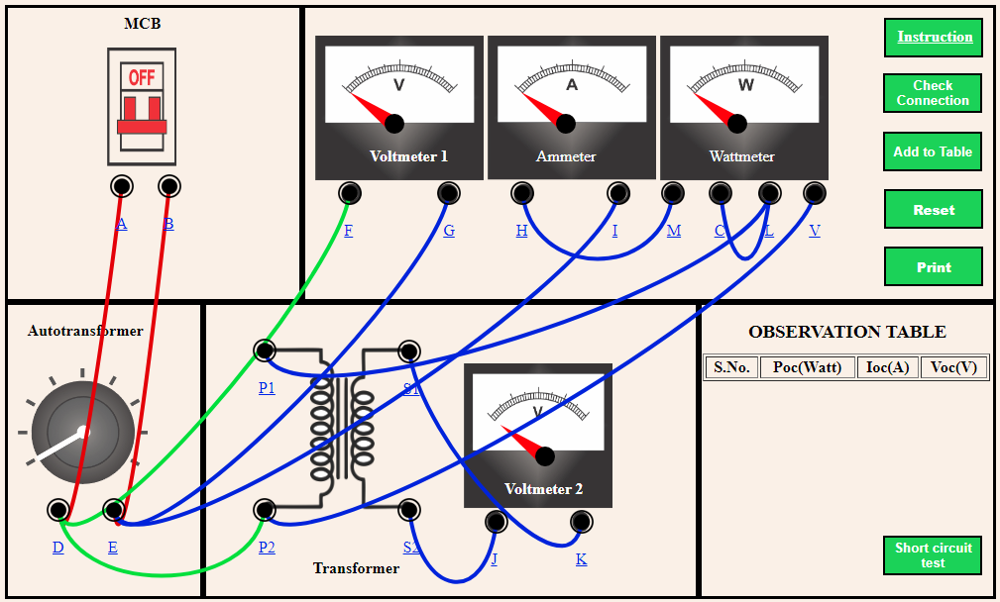
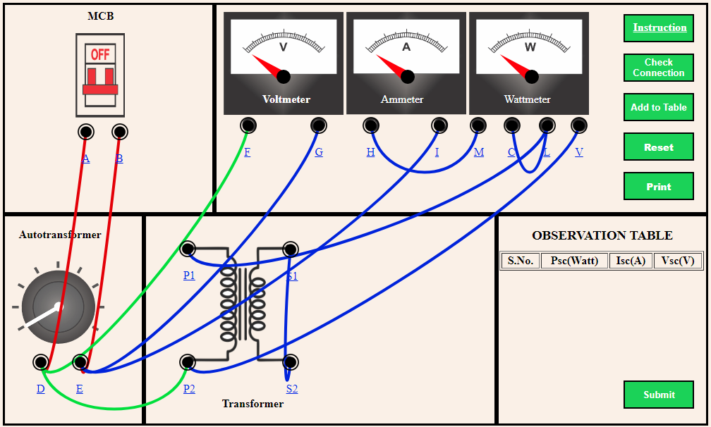

<b>STEP 1:</b> Make the proper connection by clicking the node as instructed below. If the wire is wrongly connected, Click on the node number to detach the wire.  
<table style="margin-left: 20px;">
    <tr>
        <td style="border:1px solid black;"><b>From</b></td>
        <td style="border:1px solid black;">A</td>
        <td style="border:1px solid black;">B</td>
        <td style="border:1px solid black;">D</td>
        <td style="border:1px solid black;">E</td>
        <td style="border:1px solid black;">E</td>
        <td style="border:1px solid black;">D</td>
        <td style="border:1px solid black;">H</td>
        <td style="border:1px solid black;">C</td>
        <td style="border:1px solid black;">L</td>
        <td style="border:1px solid black;">V</td>
        <td style="border:1px solid black;">S1</td>
        <td style="border:1px solid black;">S2</td>
      
</tr>
<tr>
        <td style="border:1px solid black;"><b>To</b></td>
        <td style="border:1px solid black;">D</td>
        <td style="border:1px solid black;">E</td>
        <td style="border:1px solid black;">F</td>
        <td style="border:1px solid black;">G</td>
        <td style="border:1px solid black;">I</td>
        <td style="border:1px solid black;">P2</td>
        <td style="border:1px solid black;">M</td>
        <td style="border:1px solid black;">L</td>
        <td style="border:1px solid black;">P1</td>
        <td style="border:1px solid black;">P2</td>
        <td style="border:1px solid black;">K</td>
        <td style="border:1px solid black;">J</td>
       
</tr>
</table>

 
<b>STEP 2: </b>Click on <b>"Check Connection"</b> button for checking the connections.
<li>if connection is correct, an alert appears. Click ok.  Now, go to step 4.</li>
<li>if connection is wrong, an alert appears. Click ok.  Now, go to step 3.</li> 
<b>STEP 3: </b>Check the connection and either detach the incorrect wire connection or Click on <b>"Reset"</b> button and start from step 1.  
<b>STEP 4: </b>Switch on the MCB.  
<b>STEP 5: </b>Click on the Autotransformer knob.  
<b>STEP 6: </b>Click on <b>"Add to Table"</b> button to add the readings to the observation table.  
<b>STEP 7: </b> Click on <b>"Short Circuit Test"</b> button to perform the SC Test.  
<b>STEP 8:</b> Make the proper connection by clicking the node as instructed below. If the wire is wrongly connected, Click on the node number to detach the wire.  
    <table style="margin-left: 20px;">
        <tr>
            <td style="border:1px solid black;"><b>From</b></td>
            <td style="border:1px solid black;">A</td>
            <td style="border:1px solid black;">B</td>
            <td style="border:1px solid black;">D</td>
            <td style="border:1px solid black;">E</td>
            <td style="border:1px solid black;">E</td>
            <td style="border:1px solid black;">D</td>
            <td style="border:1px solid black;">H</td>
            <td style="border:1px solid black;">C</td>
            <td style="border:1px solid black;">L</td>
            <td style="border:1px solid black;">V</td>
            <td style="border:1px solid black;">S1</td>
          
</tr>
<tr>
            <td style="border:1px solid black;"><b>To</b></td>
            <td style="border:1px solid black;">D</td>
            <td style="border:1px solid black;">E</td>
            <td style="border:1px solid black;">F</td>
            <td style="border:1px solid black;">G</td>
            <td style="border:1px solid black;">I</td>
            <td style="border:1px solid black;">P2</td>
            <td style="border:1px solid black;">M</td>
            <td style="border:1px solid black;">L</td>
            <td style="border:1px solid black;">P1</td>
            <td style="border:1px solid black;">P2</td>
            <td style="border:1px solid black;">S2</td>
           
</tr>
</table>
 
<b>STEP 9:</b> Repeat steps 2 to 6.  
<b>STEP 10: </b> Click on <b>"Submit"</b> button to get an equivalent circuit diagram of transformer.  
<b>STEP 11: </b> Click on <b>"Print"</b> button to print the webpage. 

