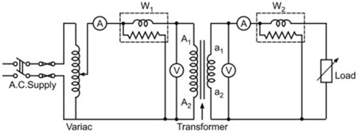
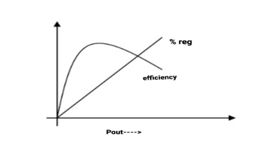

### Theory

The transformer is a device which transfers energy from one electrical circuit to another electrical circuit through magnetic field as coupling medium. In this process it does not change the frequency of voltage or current. It works on the basic principle of electromagnetic induction (mutually induced e.m.f.) being a static device it has a very efficiency as compared to rotating machine of same rating as the losses are less.

 

Figure 1: Single phase transformer on load test

 

In a practical transformer there are two type of losses:-
* Cu loss
* Core/iron loss

Therefore, Output of a transformer is always less than input of the transformer because of losses.

Here, Transformer is loaded with a variable resistive load input to the transformer can be by using a wattmeter and output can also be measured by a wattmeter or with the help of voltmeter & ammeter.

Input power to transformer = reading of wattmeter

Output power from transformer = $V_2*I_2$ [since cosɸ=load p.f.=1]

When primary winding of transformer is energized with source of voltage $V_1$ an e.m.f. $E_2$ is induced across the secondary winding and it also equal to secondary terminal voltage $V_2$ till there is no load across secondary winding. As soon as load is applied across the secondary winding the terminal voltage is decreased from $E_2$ to $V_2$ this phenomenon of changing the voltage is called *"Voltage regulation"*.

$$ VR =\frac {(NoLoadVoltage)-(DerivedLoadVoltage)} {NoLoadVoltage}*100 $$

Transformer's efficiency directly affects its performance and aging. The transformer's efficiency, in general, is in the range of 95 - 99 %. For large power transformers with very low losses, the efficiency can be as high as 99.7%. The input and output measurements of a transformer are not done under loaded conditions as the wattmeter readings inevitably suffer errors of 1 - 2%. So for the purpose of efficiency calculations, OC and SC tests are used to calculate rated core and winding losses in the transformer. The core losses depend on the transformer rated voltage, and the copper losses depend on the currents through the transformer primary and secondary windings. Hence transformer efficiency is of prime importance to operate it under constant voltage and frequency conditions. The rise in the temperature of the transformer due to heat generated affects the life of transformer oil properties and decides the type of cooling method adopted. The temperature rise limits the rating of the equipment. The **Efficiency of transformer** is simply given as:

$$ⴄ =\frac {Output power} {Input power} *100 % $$

 

Figure 2: Plot for efficiency of transformer

 

### Advantages of Single phase transformer:-

 * The cost of stand by the unit transformer is reduced.

 * The system is reliable, and service continuity ensures when transformers are connected in parallel.

 *  The transformer can switch on or off based on the load demand.

 *  If more transformed works in parallel the chance of overloading of particular transformer reduces.

### Disadvantages of Single phase transformer:-

 * The maintenance cost becomes more.

 * The space required for installing the transformed is more.

 * When one or more transformer works on a parallel then chance of fault occurrence will be increased.
  

