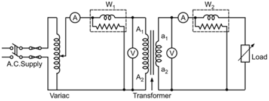

### Theory

A single-phase transformer is a static electrical device that transfers electrical energy between two circuits through electromagnetic induction. It operates on the principle of Faraday’s Law of Electromagnetic Induction, which states that a change in magnetic flux through a coil induces an electromotive force (EMF) in the coil.

 

Figure 1: Single-phase transformer on load test

 

<b> Basic components of a single-phase transformer</b>

<b>1. Core:</b> The core is constructed from laminated silicon steel to minimise eddy current losses and improve efficienvy.These laminations are insulated from each other to reduce circulating currents. The core servers as a low-reluctance path for the magnetic flux, enablimg efficient energy between the windings.

<b>2.Windings:</b> 

<b>2.1	Primary winding:</b> The primary winding is connected to the power source. When an alternating current flows through this winding, it generates an alternating magnetic field within the core.

<b>2.2	Secondary winding:</b> The secondary winding is magnetically coupled to the primary winding via the core. The changing magnetic field induced by the primary winding generates a voltage in the secondary winding, enabling energy transfer to the connected load. The voltage induced depends on the turns ratio of the primary and secondary windings, which determines whether the transformer is a step-up or step-down transformer.

In a transformer, two types of losses occur:

1. <b>Core/Iron Loss:</b> This arises from hysteresis and eddy currents within the transformer core.
2. <b>Copper Loss:</b> This occurs due to the resistance of the windings.

As a result of these losses, the output power of a transformer is always less than its input power. 

When the primary winding of a transformer is energised with a source voltage V1, an e.m.f. E2 is induced across the secondary winding. Under no-load conditions (i.e., when no load is connected to the secondary winding), this induced e.m.f. E2 is approximately equal to the secondary terminal voltage V2.

However, when a load is connected to the secondary winding, current begins to flow through the load. This causes a voltage drop across the internal impedance of the transformer (mostly due to winding resistance and leakage reactance). As a result, the secondary terminal voltage V2 decreases from its no-load value E2.

The change in the secondary terminal voltage (V2) from its no-load value (E2) to its loaded value (V2) is referred to as the voltage regulation of the transformer. Voltage regulation is typically expressed as a percentage of the no-load voltage and provides a measure of how well a transformer maintains its secondary voltage under varying load conditions.

 $VR =\frac{(\text {NoLoadVoltage}- \text{FullLoadVoltage})\times 100}{\text{NoLoadVoltage}}$

 

   
Transformer efficiency is a measure of how effectively a transformer converts the electrical power supplied to its primary winding into usable power at the secondary winding. It is defined as the ratio of the useful output power to the input power, expressed as a percentage:

$\text{Efficiency } (\eta) = \frac{\text{Output Power}}{\text{Input Power}} \times 100$

$\eta = \frac{\text{Output Power}}{\text{Output Power} + \text{Losses}}$

 
 

Figure 2: Plot for efficiency of the transformer

 

<b>Efficiency Under Different Conditions</b>

<b>Full-load Efficiency:</b> Efficiency when the transformer is operating at its rated load. 

<b>Half-load Efficiency:</b> Efficiency when the transformer is operating at a fraction of its rated load. 

<b>Maximum Efficiency:</b> Transformers are designed to achieve maximum efficiency at a specific load, typically around 50–80% of the full load, where core and copper losses are balanced. 

<b>Testing Transformer Efficiency</b>

Transformers are rarely tested under full-load conditions due to the challenges and errors associated with direct measurement of input and output power. Instead, efficiency is calculated indirectly using:

1. <b>Open-Circuit (OC) Test:</b>
o  Used to measure core losses.
o  Performed by energizing the primary winding at the rated voltage with the secondary winding open.

2. <b>Short-Circuit (SC) Test:</b>
o  Used to measure copper losses.
o  Performed by applying a reduced voltage to the primary winding with the secondary winding short-circuited, ensuring the rated current flows through the windings.

<b> Importance of Transformer Efficiency:</b>

1. <b>Economic Impact:</b> High-efficiency transformers reduce energy losses, leading to lower operating costs over time.
2. <b>Reliability and Lifespan:</b> An efficient transformer operates with minimal heat generation, preserving the life of winding insulation and transformer oil.

<b>Advantages of single-phase transformer:</b>

1. The cost of a standby unit transformer is reduced.
2. The system becomes more reliable, and service continuity is ensured when transformers are connected in parallel.
3. The transformer can be switched on or off based on the load demand.
4. When multiple transformers work in parallel, the chance of overloading a particular transformer is reduced.

<b>Disadvantages of single-phase transformer:</b>
1. The maintenance cost is higher.
2. More space is required for installing the transformer.

